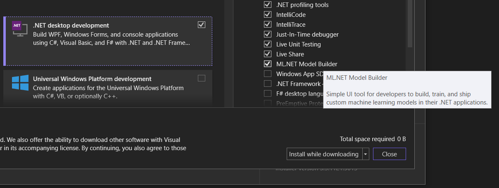

# inclusive-code-reviews-ml

Machine learning for code reviews!

`ml.net` folder is an example using ML.NET Model Builder in Visual Studio.

`tfjs` folder is TensorFlowJS setup to run tests. (Not really working)

## ML.NET Model Builder

To retrain the model, install the `ML.NET Model Builder` in Visual Studio:



TBD if you can do this command-line or on a Mac.

## `mlnet` .NET Global Tool

Install with:

```dotnetcli
dotnet tool install --global mlnet
```

And you can train, such as:

```dotnetcli
mlnet classification --dataset .\MLConsoleApp\test.csv --label-col 1 --has-header true --train-time 10
```

This outputs a folder named `SampleClassification` in the current
directory. It's not exactly the same output the ML.NET Model Builder
outputs, but this should also work on a Mac.

See the [ML.NET docs][mlnet] for more info.

[mlnet]: https://docs.microsoft.com/dotnet/machine-learning/automate-training-with-cli

## Code Review Examples

These are just some links to "heated" conversations:

* https://lkml.iu.edu/hypermail/linux/kernel/1510.3/02866.html

## CloudMine

If you would like to access CloudMine, see:

* https://1esdocs.azurewebsites.net/datainsights/cloudmine/access.html?tabs=user
* https://dataexplorer.azure.com/clusters/1es/databases/GitHub
* https://dataexplorer.azure.com/clusters/1es/databases/AzureDevOps

An example querying 100 random comments would be:

```kusto
PullRequestReviewComment
| where ReviewerLogin == 'rolfbjarne'
| where RepositoryName == 'xamarin-macios'
| order by rand()
| limit 100
| project OrganizationLogin, RepositoryName, ReviewerLogin, HtmlUrl, Body
```

I would be careful and only grab from a public repository of a MSFT
employee that gave you permission.
